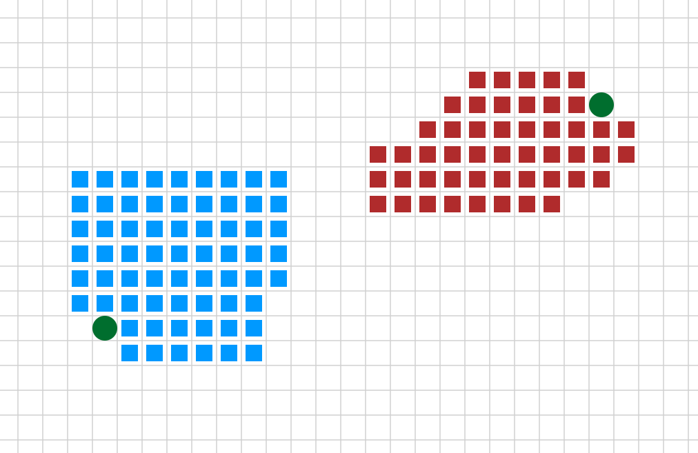

# A-Star Pathfinding Algoirthm & Variations 
This repository is part of my work for the Melbourne Space Program. In this repository I have implemented variations of the a-start pathfinding algorithm. The purpose is to compare efficiency metrics and have a code base variations.

# Compared Algorithms 
    1. Base A-Star 
    2. Simple Bidirectional A-Star 
    3. Weighted A*
    4. Dynamic Weighted A*  

### Bidirectional A-Star 
Instead of searching from the start to the finish, we can start two searches in parallel―one from start to finish, and one from finish to start. When they meet, or the any of the searches reach their target we get a path. 

Uni-directional A*          |      Bidirectional A*
--------------------|---------------------
   | 

Time complexity:
- Regular A* => O(bd)
- Bidirectional A* => O(bd/2)

Here **b** is the branching factor and **d** is distance of goal vertix from source 

Research Paper: https://arxiv.org/pdf/1703.03868.pdf

### Weighted A* 
With Weighted A* we are making a tradeoff between optimal path and speed. We add a bias towards finding the goal hence the target finding procedure is speed up. However, Weighted A* does not provide the most optimal map. 

Instead of calculating 
    Regular A* => cost = g(n) + h(n)
    Weighted A* =? cost = g(n) + w * h(n)
Formal of defining this.  
    Heuristic calculation, h(w) = h(n) = ε h(n) where ε > 1

Regular A*          |        Weighted A*
--------------------|---------------------
   | 

As we can see the weighted A* algorithm explores a lower number of nodes and finds our goal quicker. 

Further info: 
- [Stack Overflow](https://stackoverflow.com/questions/44274729/a-search-advantages-of-dynamic-weighting)
- Wikipedia -- [Bounded Relaxation for the A* Search Algorithm](https://en.wikipedia.org/wiki/A*_search_algorithm#/media/File:Astar_progress_animation.gif)

### Dynamic Weighted A* 

Research Paper: https://www.cs.auckland.ac.nz/courses/compsci709s2c/resources/Mike.d/Pohl1973WeightedAStar.pdf

# Implemented Heuristics 
1. Euclidean Heuristic 
2. Manhattan Distance 
3. Diagonal Distance 

 

# Running instructions 

Under Progress 
